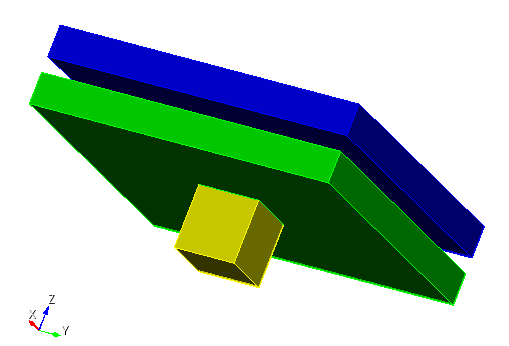

# Overview of Tutorials that start by creating a CAD file using Cubit/Trelis

### Basic Models using UW2 workflow:

  * __Simple two slab model__ 
    - Illustrates the UW2 workflow
    - Create materials using PyNE (python script)
    - Create and prepare the model using a Cubit/Trelis journal script
      * includes imprinting/merging, assigning materials, model faceting
    - Provides a sample DAG-MCNP6.2 input file
    - [Full tutorial](twoslab.md)
    
  
The Simple two slab model geometry consists of 2 slabs and a cube that holds the source.

  * __More complex model__ (under construction)
    - Illustrates UW2 workflow
    - Create materials using PyNE (python script)
    - Create and prepare model using Cubit/Trelis journal script
